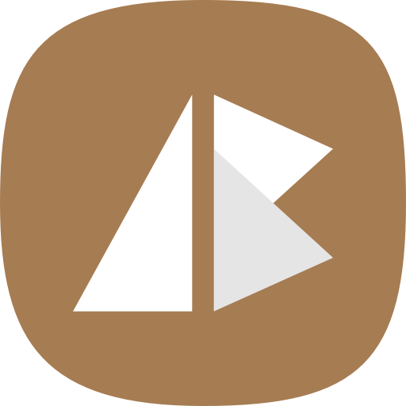

  <!-- Ab - Logo --> 
  

### Hi there 👋🏾

- 👀 I’m interested in building **P**rogressive **W**eb **A**pps w/ `Next.JS`, `Lit` & `Flutter` ♥️ and command-line programs with `Go`.
- 💻 I'm working on a my [ab-elements-app](https://github.com/abraham-ukachi/ab-elements-app).
- 🌱 I’m currently learning some advanced features of `Next.JS` (ISR, server actions, turbopack, analytics) etc...
- 👯 I’m looking to collaborate on some interesting projects with my friends/classmates at [LaPlateforme_](https://laplateforme.io).
- 🤔 I’m looking for help on how to integrate a custom `GPT` to a `Next.JS` bootstraped app.
- 💬 Ask me about my 9 years in Ukraine.
- 📫 You can send me an [email](abraham.ukachi@laplateforme.io) anytime, [message](https://t.me/abrahamukachi) sometime, or follow me on [X](https://x.com/abrahamukachi).
- 😄 Pronouns: He/Him 😜.
- ⚡ Fun fact: I've got some **salsa**, **kizomba**, **bachata** & **afro** dance moves 🕺 and I love to cook 🍕.

## 🔧 Technologies & Tools

